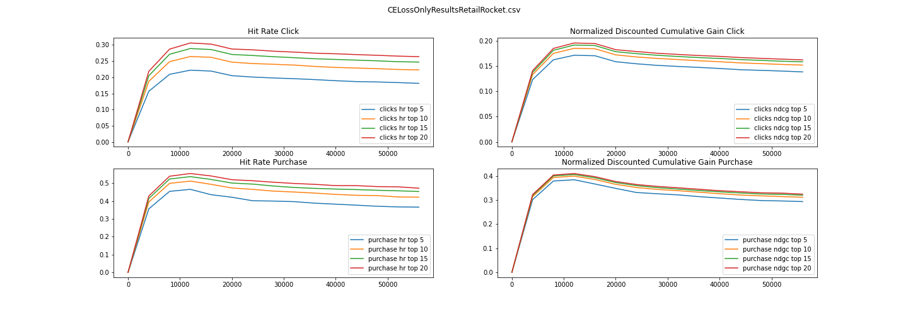
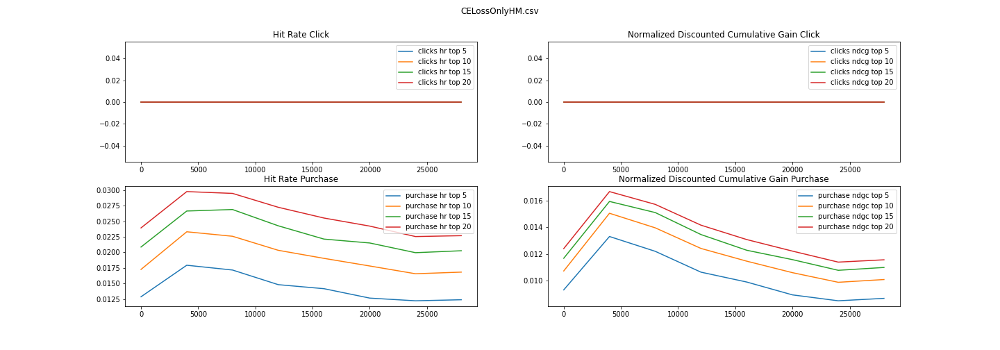

# AIPI Final Project: Team MSEC


## Introduction

In this project we train different session based product recommendation
recommender and compare the performance of the recommenders. 

## Data

We use two datasets: the H&M Personalized Fashion Recommendations dataset, and the Retailrocket recommender system dataset.

## Evaluation metrics

We use two offline evaluation metrics: Normalized Discounted Cumulative Gain (NDCG) and Hit Ratio (HR). 

## Algorithms

We use SA2C and a standard deep learning set up of a GRU using only cross entropy loss to train the network. In this project we want to look at the gains from adding a reinforcement learning regularization to cross entropy loss.

## Results

We run compare the metric development for various values of K (5,10,15 and 20). We look at metrics applied to clicks and to purchases.








First, we plot the results for each model, across both dataset. We look at HR and NDCG by click and by purchase.

| **Models**         | **HR@5** | **NDCG@5** | **HR@10** | **NDCG@10** | **HR@15** | **NDCG@15** | **HR@20** | **NDCG@20** |
| :---------:        | :------: | :------:   | :-------: | :-------:   | :-------: | :-------:   | :-------: | :-------:   |
| RR: GRU-NonDL   |   0.3657  |  0.2934    |  0.4214   |   0.3115    |  0.4534  |  0.3199      |   0.4717  |   0.3242     | 
| RR: GRU-SA2C   |   0.5350  |   0.4570    |   0.5872   |   0.4742    |   0.6095  |   0.4801    | 0.6263  |    0.4841     | 
| HM: GRU-NonDL   |  0.0123  |  0.0086   |  0.0168   |   0.0100    |  0.0202  |  0.0109      | 0.0226 |   0.0115     | 
| HM: GRU-SA2C   |  0.0121  |   0.0087   |  0.01838   |   0.0107    |   0.0216  |  0.0116     | 0.0242  |   0.0122     | 

We then compared the results by click for the RR data.


| **Models**         | **HR@5** | **NDCG@5** | **HR@10** | **NDCG@10** | **HR@15** | **NDCG@15** | **HR@20** | **NDCG@20** |
| :---------:        | :------: | :------:   | :-------: | :-------:   | :-------: | :-------:   | :-------: | :-------:   |
| RR: GRU-NonDL   |  0.1811  |  0.1386    |  0.2227   |   0.1520    |  0.2469  |  0.1585      | 0.2637   |   0.1625     | 
| RR: GRU-SA2C   |  0.2713  |  0.2136    |  0.3199   |   0.2294    |   0.3469  |  0.2365     | 0.3649  |   0.2408     | 


## Conclusion

The GRU-SA2C methods outperform the NonDL methods across the two datasets. 


### Example

To models are run via the command line. The results are stored in the results folder, but this location can be changed with the results_path command line argument. 

```
python SA2C.py --model=GRU --epoch=15 --data=../../data/data_rr/
```

## Code Structure
```
├── README.md
├── img
│   └── retail_rocket.png
├── notebooks
│   ├── ResultPlotting.ipynb
│   ├── CELossOnly_rr_experiments.ipynb
│   ├── sa2c_rr_experiments.ipynb
│   ├── CELossOnly_hm_experiments.ipynb
│   ├── sa2c_hm_experiments.ipynb
|   |── rr_tester.ipynb
|   |── hm_tester.ipynb
│   └── HM_SNQN_SASRec.ipynb
├── src
|   ├── models
|   |   ├── CELossOnly.py
|   |   ├── NextItNetModules.py
|   |   ├── pop.py
|   |   ├── SA2C.py
|   |   ├── SASRecModules.py
|   |   ├── SNQN.py
|   |   ├── split_data.py
|   |   ├── test.py
|   |   └── utility.py
|   └── preprocessing
|       |── gen_replay_buffer_hm.py
|       └── preprocess_kaggle.py
├── data
|   ├── data_hm
|   └── data_hm
└── results

```


## References


Xin, Xin, et al. "Supervised Advantage Actor-Critic for Recommender Systems." Proceedings of the Fifteenth ACM International Conference on Web Search and Data Mining. 2022.
[<a href="https://arxiv.org/abs/2111.03474 ">arxiv</a>]

Vaswani, Ashish, et al. "Attention is all you need." Advances in neural information processing systems 30 (2017).


## Data sources

H&M Personalized Fashion Recommendations  [<a href="https://www.kaggle.com/competitions/h-and-m-personalized-fashion-recommendations/data?select=transactions_train.csv">dataset</a>]

Retailrocket Recommender System [<a href="https://www.kaggle.com/datasets/retailrocket/ecommerce-dataset?select=category_tree.csv
">dataset</a>]


### Authors: Jordan Axelrod, Alexander Whitefield
